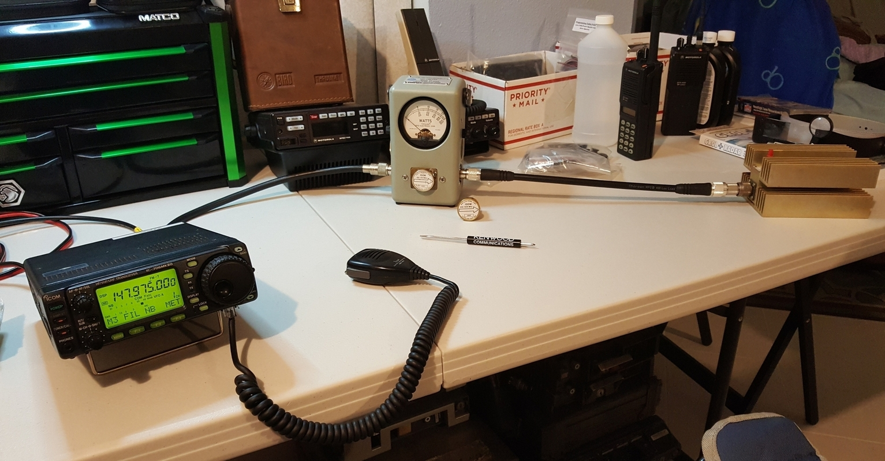

# Icom IC-706 MkIIG Repairs and Modifications:

- This repo documents common repairs and modifications I have made to my Icom IC-706 MkIIG ham radio.

   

 

My first Icom IC-706 HF/VHF radio which was installed in my truck.

  
 

Here is my current IC-706 MkIIG HF/VHF/UHF Radio.

<h3>Note the differences between the two radios, since none of this applies to the older IC-706.</h3>

 
 

A Quick Test Setup for the IC-706 MkIIG using a Bird 43 & a 100W Dummy Load.

## Status:

